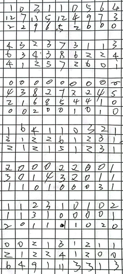

# 修改说明

我们在识别某些内容尤其是手写文字、数字时，明知道里面不包含字符，正常识别结果总会出现我们不想要的字符。因此希望通过设置，在识别结果中排除不希望出现的字符或仅返回我们指定字符范围内的字符。

我们通过少量修改paddleocr中的几个文件，基本实现了以上需求。
  
【cmd命令行测试可用，python中调用还未测试正确】

## 主要需要修改的文件

> 1. 增加命令行参数。修改paddleocr\tools\infer\utility.py文件的init_args函数，增加两个参数，分别用于识别字符范围和排除字符范围
```python
    # init_args函数末尾新增两个参数
    parser.add_argument("--limit_char_list", type=Union[str, list], default=None)  # 在给定字符范围内识别，输入字典文件
    parser.add_argument("--exclude_char_list", type=Union[str, list], default=None)  # 在识别中不要识别哪些字符，输入字典文件
    # 字典文件格式参考paddleocr\ppocr\utils中的*.dict.txt文件
    return parser
```
> 2. 将命令行参数配置给后处理，修改paddleocr\tools\infer\predict_rec.py文件，TextRecognizer类的__init__

```python
        # 在build_post_process之前，将命令行参数传递给后处理过程
        postprocess_params['limit_char_list'] = args.limit_char_list
        postprocess_params['exclude_char_list'] = args.exclude_char_list
        
        self.postprocess_op = build_post_process(postprocess_params)
```

> 3. 在后处理过程中读取配置文件，修改paddleocr\ppocr\postprocess\rec_postprocess.py文件，TextRecognizer类的__init__形参中增加参数，并在函数内对配置文件进行读取：
def __init__(self, character_dict_path=None, use_space_char=False, **limit_char_list=None, exclude_char_list=None**):

```python
        # TextRecognizer类的__init__函数末尾添加代码，将文件内容读取赋值给类的属性self.limit_char_list和self.exclude_char_list
        self.limit_char_list = []
        if limit_char_list is not None:
            with open(limit_char_list, "rb") as fin:
                lines = fin.readlines()
                for line in lines:
                    line = line.decode('utf-8').strip("\n").strip("\r\n")
                    self.limit_char_list.append(line)
        self.exclude_char_list = []
        if exclude_char_list is not None:
            with open(exclude_char_list, "rb") as fin:
                lines = fin.readlines()
                for line in lines:
                    line = line.decode('utf-8').strip("\n").strip("\r\n")
                    self.exclude_char_list.append(line)
```

> 4. 最后，修改paddleocr\ppocr\postprocess\rec_postprocess.py文件，对正常识别结果依据自定义参数进行过滤。

## 曾尝试三种思路

### 思路一

修改rec_postprocess.py子类CTCLabelDecode【默认使用的识别方法】中的以下代码
注：这是最初的思路，仅实现了在给定范围内搜索，还未考虑排除项、如何添加命令行参数等，所以代码中有些变量名与之前写的命令行参数名不一样。

```python
preds_idx = preds.argmax(axis=2)   
preds_prob = preds.max(axis=2) 
```

这两句代码，返回所有字符的概率最大值、对应索引。修改改为返回自定义的字符字典中对应字符的概率最大值、对应索引。
示例：

```python
        if rec_limit_char_dict =="" and rec_exclude_char_dict=="":
            preds_idx = preds.argmax(axis=2)   #未指定特定字符，正常识别
            preds_prob = preds.max(axis=2)  
        else:
            # 如果指定了识别字符范围，在识别结果中挑选出给出在字符概率，找到其中的最大概率值
            if limit_char_list is None:  # 仅指定排除字符时，先将限制查找字符设置为整个字符集
                limit_char_list = self.character
            else:
                limit_char_list.append("blank")  # 必须增加空值【此项是self.character中的第一项，必须加上！！】
            # 去掉需要排除的字符
            limit_char_list = [x for x in limit_char_list if x not in self.exclude_char_list]
            # 获取要识别的字符（比如0-9）在整个字符集self.character中的位置Index
            char_ind = [self.character.index(char) for char in limit_char_list]
            # [26, 93, 25, 94, 632, 631, 933, 29, 27, 1109, 0] 不连续的，和chinese_dict.txt中的次序不一样！
            # 从preds结果中筛选出我们需要识别字符的概率数据
            my_preds=preds[:,:,char_ind]
            # 获取my_preds中的最大概率和对应索引及概率值
            my_preds_idx = my_preds.argmax(axis=2)  # 注意返回的最大概率序号是mypreds中的序号，也是limit_char_list中的序号，不是preds中的序号
            preds_prob = my_preds.max(axis=2)
            # 将序号列表中自定义字符中的次序修改为self.character中的次序
            preds_idx = np.empty(shape=preds_prob.shape)
            for i,row in enumerate(my_preds_idx):
                preds_idx[i,:] = [ char_ind[j] for j in row ]
            preds_idx = preds_idx.astype(int)
```

**优点**：由于仅在识别完毕后对结果进行了筛选，对整个识别速度的影响比较小；

**缺点**：由于preds_idx和preds_prob在rec_postprocess.py中多个子类中都有，需要修改代码的位置比较多【可以尝试使用自定义函数】减少一些代码冗余；不确定格式是否相同，可能还要根据不同的算法，对preds_idx和preds_prob进行不同的操作。缺点较多，因此没有再进一步优化代码。

### 思路二

针对rec_postprocess.py中的父类BaseRecLabelDecode进行修改，以便能够在其多个子类中都能通用。

修改父类的decode函数，将需限制/排除的字符都转化为排除字符，加入到现有的ignored_tokens
decode函数已经包含了排除ignored_tokens中的字符的筛选功能，所以后面的代码就不用修改了

```python
    def decode(self, text_index, text_prob=None, is_remove_duplicate=False):
        ...
        # 如果exclude_char_list不为空，将其中的字符的序号添加到ignored_tokens中
        if len(self.exclude_char_list) > 0:
            more_ignored = [ self.character.index(c) for c in self.exclude_char_list if c in self.character ]
            ignored_tokens.extend(more_ignored)
        # 如果limit_char_list不为空，将character中除了limit_char_list的所有字符加入到ignored_tokens
        # 字符在self.character中的次序见文件：PaddleOCR\ppocr\utils\ppocr_keys_v1.txt，0-9并不连续
        if len(self.limit_char_list) > 0:
            more_ignored = [ self.character.index(c) for c in self.character if c not in self.limit_char_list
                             and c not in self.exclude_char_list ]
            ignored_tokens.extend(more_ignored)
        ...
```
**优点**：实现简单，修改代码量小

**缺点**：在decode中增加的运算会导致整个识别过程明显变慢（尤其是给定的字符范围较少，ignored_tokens列表较大）

针对240*534的手写数字图片（如图）测试：



未指定识别字符范围时，识别速度0.4：

```bash
[2023/11/02 07:30:00] ppocr INFO: **********11-out-out.png**********
[2023/11/02 07:30:06] ppocr DEBUG: dt_boxes num : 109, elapsed : 5.441429376602173
[2023/11/02 07:30:06] ppocr DEBUG: rec_res num  : 109, elapsed : 0.4692959785461426
[2023/11/02 07:30:06] ppocr INFO: [[[170.0, 10.0], [177.0, 10.0], [177.0, 20.0], [170.0, 20.0]], ('S', 0.5686436891555786)]
[2023/11/02 07:30:06] ppocr INFO: [[[226.0, 6.0], [234.0, 15.0], [228.0, 22.0], [219.0, 13.0]], ('X', 0.563069760799408)]
[2023/11/02 07:30:06] ppocr INFO: [[[11.0, 30.0], [29.0, 30.0], [29.0, 41.0], [11.0, 41.0]], ('12', 0.5814390182495117)]
[2023/11/02 07:30:06] ppocr INFO: [[[88.0, 28.0], [98.0, 28.0], [98.0, 57.0], [88.0, 57.0]], ('U', 0.5983806848526001)]
[2023/11/02 07:30:06] ppocr INFO: [[[108.0, 30.0], [126.0, 23.0], [131.0, 40.0], [113.0, 46.0]], ('12', 0.5705482959747314)]
[2023/11/02 07:30:06] ppocr INFO: [[[111.0, 45.0], [123.0, 45.0], [123.0, 58.0], [111.0, 58.0]], ('t', 0.690372109413147)]
[2023/11/02 07:30:06] ppocr INFO: [[[65.0, 81.0], [72.0, 81.0], [72.0, 91.0], [65.0, 91.0]], ('2', 0.9312396049499512)]
[2023/11/02 07:30:06] ppocr INFO: [[[9.0, 103.0], [19.0, 96.0], [26.0, 108.0], [16.0, 115.0]], ('6', 0.5105475187301636)]
[2023/11/02 07:30:06] ppocr INFO: [[[63.0, 99.0], [74.0, 99.0], [74.0, 114.0], [63.0, 114.0]], ('4', 0.9933532476425171)]
[2023/11/02 07:30:06] ppocr INFO: [[[88.0, 97.0], [99.0, 97.0], [99.0, 118.0], [88.0, 118.0]], ('2', 0.5246984958648682)]
[2023/11/02 07:30:06] ppocr INFO: [[[168.0, 100.0], [180.0, 100.0], [180.0, 119.0], [168.0, 119.0]], ('M', 0.5838358998298645)]
[2023/11/02 07:30:06] ppocr INFO: [[[89.0, 117.0], [99.0, 117.0], [99.0, 135.0], [89.0, 135.0]], ('S', 0.746360182762146)]
[2023/11/02 07:30:06] ppocr INFO: [[[119.0, 120.0], [127.0, 120.0], [127.0, 134.0], [119.0, 134.0]], ('7', 0.7886289358139038)]
[2023/11/02 07:30:06] ppocr INFO: [[[14.0, 182.0], [24.0, 182.0], [24.0, 207.0], [14.0, 207.0]], ('N', 0.9296107888221741)]
[2023/11/02 07:30:06] ppocr INFO: [[[44.0, 205.0], [54.0, 205.0], [54.0, 226.0], [44.0, 226.0]], ('?', 0.6449623703956604)]
[2023/11/02 07:30:06] ppocr INFO: [[[64.0, 210.0], [72.0, 210.0], [72.0, 222.0], [64.0, 222.0]], ('N', 0.8266884088516235)]
[2023/11/02 07:30:06] ppocr INFO: [[[113.0, 207.0], [125.0, 207.0], [125.0, 222.0], [113.0, 222.0]], ('D', 0.7881701588630676)]
[2023/11/02 07:30:06] ppocr INFO: [[[60.0, 245.0], [73.0, 245.0], [73.0, 280.0], [60.0, 280.0]], ('M', 0.7202562093734741)]
[2023/11/02 07:30:06] ppocr INFO: [[[143.0, 247.0], [151.0, 247.0], [151.0, 263.0], [143.0, 263.0]], ('2', 0.940317690372467)]
[2023/11/02 07:30:06] ppocr INFO: [[[40.0, 267.0], [45.0, 267.0], [45.0, 274.0], [40.0, 274.0]], ('1', 0.5631221532821655)]
[2023/11/02 07:30:06] ppocr INFO: [[[113.0, 264.0], [126.0, 264.0], [126.0, 282.0], [113.0, 282.0]], ('b', 0.6280779838562012)]
[2023/11/02 07:30:06] ppocr INFO: [[[191.0, 261.0], [202.0, 261.0], [202.0, 282.0], [191.0, 282.0]], ('3', 0.7368597388267517)]
[2023/11/02 07:30:06] ppocr INFO: [[[14.0, 283.0], [23.0, 283.0], [23.0, 294.0], [14.0, 294.0]], ('N', 0.5307120084762573)]
[2023/11/02 07:30:06] ppocr INFO: [[[64.0, 284.0], [72.0, 284.0], [72.0, 294.0], [64.0, 294.0]], ('N', 0.5054392218589783)]
[2023/11/02 07:30:06] ppocr INFO: [[[193.0, 282.0], [204.0, 282.0], [204.0, 298.0], [193.0, 298.0]], ('3', 0.7031792402267456)]
[2023/11/02 07:30:06] ppocr INFO: [[[61.0, 319.0], [73.0, 319.0], [73.0, 334.0], [61.0, 334.0]], ('D', 0.5167797207832336)]
[2023/11/02 07:30:06] ppocr INFO: [[[116.0, 321.0], [125.0, 321.0], [125.0, 333.0], [116.0, 333.0]], ('2', 0.8957492709159851)]
[2023/11/02 07:30:06] ppocr INFO: [[[36.0, 338.0], [47.0, 338.0], [47.0, 351.0], [36.0, 351.0]], ('Q', 0.6713586449623108)]
[2023/11/02 07:30:06] ppocr INFO: [[[141.0, 335.0], [152.0, 337.0], [150.0, 359.0], [138.0, 357.0]], ('7', 0.5192517638206482)]
[2023/11/02 07:30:06] ppocr INFO: [[[63.0, 394.0], [73.0, 394.0], [73.0, 410.0], [63.0, 410.0]], ('2', 0.9988333582878113)]
[2023/11/02 07:30:06] ppocr INFO: [[[164.0, 438.0], [174.0, 430.0], [180.0, 438.0], [170.0, 446.0]], ('C', 0.8222995400428772)]
[2023/11/02 07:30:06] ppocr INFO: [[[37.0, 471.0], [44.0, 471.0], [44.0, 482.0], [37.0, 482.0]], ('D', 0.7734867930412292)]
[2023/11/02 07:30:06] ppocr INFO: [[[65.0, 489.0], [72.0, 489.0], [72.0, 503.0], [65.0, 503.0]], ('2', 0.7489694356918335)]
[2023/11/02 07:30:06] ppocr INFO: [[[89.0, 487.0], [99.0, 487.0], [99.0, 507.0], [89.0, 507.0]], ('N', 0.5773365497589111)]
[2023/11/02 07:30:06] ppocr INFO: [[[112.0, 487.0], [126.0, 484.0], [130.0, 510.0], [116.0, 512.0]], ('4', 0.9653433561325073)]
[2023/11/02 07:30:06] ppocr INFO: [[[166.0, 489.0], [173.0, 489.0], [173.0, 503.0], [166.0, 503.0]], ('N', 0.8171042799949646)]
[2023/11/02 07:30:06] ppocr INFO: [[[117.0, 512.0], [125.0, 512.0], [125.0, 521.0], [117.0, 521.0]], ('1', 0.6527138352394104)]
```

增加字符范围0~9时，速度慢了10倍左右：

```bash
[2023/11/02 07:40:25] ppocr INFO: **********11-out-out.png**********
[2023/11/02 07:40:28] ppocr DEBUG: dt_boxes num : 109, elapsed : 2.2623496055603027
[2023/11/02 07:40:33] ppocr DEBUG: rec_res num  : 109, elapsed : 5.4224371910095215
[2023/11/02 07:40:33] ppocr INFO: [[[11.0, 30.0], [29.0, 30.0], [29.0, 41.0], [11.0, 41.0]], ('12', 0.5814390182495117)]
[2023/11/02 07:40:33] ppocr INFO: [[[108.0, 30.0], [126.0, 23.0], [131.0, 40.0], [113.0, 46.0]], ('12', 0.5705482959747314)]
[2023/11/02 07:40:33] ppocr INFO: [[[65.0, 81.0], [72.0, 81.0], [72.0, 91.0], [65.0, 91.0]], ('2', 0.9312396049499512)]
[2023/11/02 07:40:33] ppocr INFO: [[[9.0, 103.0], [19.0, 96.0], [26.0, 108.0], [16.0, 115.0]], ('6', 0.5105475187301636)]
[2023/11/02 07:40:33] ppocr INFO: [[[63.0, 99.0], [74.0, 99.0], [74.0, 114.0], [63.0, 114.0]], ('4', 0.9933532476425171)]
[2023/11/02 07:40:33] ppocr INFO: [[[88.0, 97.0], [99.0, 97.0], [99.0, 118.0], [88.0, 118.0]], ('2', 0.5246984958648682)]
[2023/11/02 07:40:33] ppocr INFO: [[[119.0, 120.0], [127.0, 120.0], [127.0, 134.0], [119.0, 134.0]], ('7', 0.7886289358139038)]
[2023/11/02 07:40:33] ppocr INFO: [[[213.0, 172.0], [229.0, 170.0], [235.0, 223.0], [219.0, 225.0]], ('0', 0.5398694276809692)]
[2023/11/02 07:40:33] ppocr INFO: [[[143.0, 247.0], [151.0, 247.0], [151.0, 263.0], [143.0, 263.0]], ('2', 0.940317690372467)]
[2023/11/02 07:40:33] ppocr INFO: [[[40.0, 267.0], [45.0, 267.0], [45.0, 274.0], [40.0, 274.0]], ('1', 0.5631221532821655)]
[2023/11/02 07:40:33] ppocr INFO: [[[191.0, 261.0], [202.0, 261.0], [202.0, 282.0], [191.0, 282.0]], ('3', 0.7368597388267517)]
[2023/11/02 07:40:33] ppocr INFO: [[[193.0, 282.0], [204.0, 282.0], [204.0, 298.0], [193.0, 298.0]], ('3', 0.7031792402267456)]
[2023/11/02 07:40:33] ppocr INFO: [[[116.0, 321.0], [125.0, 321.0], [125.0, 333.0], [116.0, 333.0]], ('2', 0.8957492709159851)]
[2023/11/02 07:40:33] ppocr INFO: [[[141.0, 335.0], [152.0, 337.0], [150.0, 359.0], [138.0, 357.0]], ('7', 0.5192517638206482)]
[2023/11/02 07:40:33] ppocr INFO: [[[63.0, 394.0], [73.0, 394.0], [73.0, 410.0], [63.0, 410.0]], ('2', 0.9988333582878113)]
[2023/11/02 07:40:33] ppocr INFO: [[[65.0, 489.0], [72.0, 489.0], [72.0, 503.0], [65.0, 503.0]], ('2', 0.7489694356918335)]
[2023/11/02 07:40:33] ppocr INFO: [[[112.0, 487.0], [126.0, 484.0], [130.0, 510.0], [116.0, 512.0]], ('4', 0.9653433561325073)]
[2023/11/02 07:40:33] ppocr INFO: [[[117.0, 512.0], [125.0, 512.0], [125.0, 521.0], [117.0, 521.0]], ('1', 0.6527138352394104)]
```

## 思路三

在思路二的基础上修改，改善识别效率。一般在指定识别字符范围时，字符数量比较少（比如只识别阿拉伯数字0-9），列表长度远小于self.character（lang=ch时有6600多个分类）的长度，这时ignored_tokens长度≈self.character，在两个大列表中筛选结果对速度影响过大

```python
    def decode(self, text_index, text_prob=None, is_remove_duplicate=False):
        """ convert text-index into text-label. """
        result_list = []
        ignored_tokens = self.get_ignored_tokens()  # 注意这里是character中的序号列表，而不是字符列表
        # 如果exclude_char_list不为空，将其中的字符的序号添加到ignored_tokens中
        if len(self.exclude_char_list) > 0:
            more_ignored = [ self.character.index(c) for c in self.exclude_char_list if c in self.character ]
            ignored_tokens.extend(more_ignored)
        # 如果limit_char_list不为空，从character中筛选出除了ignored_tokens的字符和在character中的序号
        # 字符在self.character中的次序见文件：PaddleOCR\ppocr\utils\ppocr_keys_v1.txt，0-9并不连续
        if len(self.limit_char_list) > 0:
            limit_character = [ self.character.index(c) for c in self.character if c in self.limit_char_list
                             and self.character.index(c) not in ignored_tokens ]
            #ignored_tokens.extend(more_ignored)
        else:  # 为了后面不再判定是否传入了limit_char_list参数，代码效率待评估   #经测试这种方式影响正常测试效率！！
            limit_character = [ self.character.index(c) for c in self.character if
                             self.character.index(c) not in ignored_tokens ]
        #print("limit_character:",limit_character)
        batch_size = len(text_index)
        for batch_idx in range(batch_size):
            selection = np.ones(len(text_index[batch_idx]), dtype=bool)
            if is_remove_duplicate:
                selection[1:] = text_index[batch_idx][1:] != text_index[
                    batch_idx][:-1]
            # 修改，将不在limit_character列表中的text_index，设置掩码、过滤
            # 原来的for ignored_token in ignored_tokens: 可以删除了
            
            #for ignored_token in ignored_tokens:
            #    selection &= text_index[batch_idx] != ignored_token
            
            for idx, char in enumerate(text_index[batch_idx]):
                selection[idx] &= char in limit_character
            #print("decode:selection",selection)
            char_list = [
                self.character[text_id]
                for text_id in text_index[batch_idx][selection]
            ]
            #print("char_list:",char_list)
```

针对指定--limit_char_list参数时，识别速度与之前正常识别情况相当，但用此代码不加参数时，发现正常识别效率变慢！测试如下：

```bash
paddleocr --image_dir=11-out-out.png --limit_char_list=".\dict.txt"
[2023/11/02 13:24:33] ppocr INFO: **********11-out-out.png**********
[2023/11/02 13:24:35] ppocr DEBUG: dt_boxes num : 109, elapsed : 2.1279399394989014
[2023/11/02 13:24:35] ppocr DEBUG: rec_res num  : 109, elapsed : 0.4230155944824219
# 结果略……与之前类似

# 发现会导致正常识别速度变慢~~~
paddleocr --image_dir=11-out-out.png
[2023/11/02 13:27:18] ppocr INFO: **********11-out-out.png**********
[2023/11/02 13:27:20] ppocr DEBUG: dt_boxes num : 109, elapsed : 1.8821444511413574
[2023/11/02 13:27:29] ppocr DEBUG: rec_res num  : 109, elapsed : 9.167996406555176
# 结果略……与之前展示结果一样
```

#### 改进

不能用单独的ignored_token列表或类似的limit_character列表同时处理带有--limit_char_list参数及不加该参数的两种情况，不然会导致至少一种情况效率太差。

```python
#       将思路3中的else代码删除掉
        else:  # 为了后面不再判定是否传入了limit_char_list参数，代码效率待评估   #这种方式影响正常测试效率！！
            limit_character = [ self.character.index(c) for c in self.character if
                             self.character.index(c) not in ignored_tokens ]
```

selection掩码处理时新增一个判定，根据是否传入了参数进行不同处理

```python
            for ignored_token in ignored_tokens:
                selection &= text_index[batch_idx] != ignored_token
            # 下面增加一个判断
            if len(self.limit_char_list)>0:
                for idx, char in enumerate(text_index[batch_idx]):
                    selection[idx] &= char in limit_character
...
```

经以下测试，使用--limit_char_list参数和不使用参数二者速度相似【若指定的范围太大时，预计还是会一定程度上影响识别速度，但总会好于之前的方法】

```bash
# 使用自定义参数
paddleocr --image_dir=11-out-out.png --limit_char_list=".\dict.txt"
[2023/11/02 13:53:42] ppocr INFO: **********11-out-out.png**********
[2023/11/02 13:53:45] ppocr DEBUG: dt_boxes num : 109, elapsed : 2.9718198776245117
[2023/11/02 13:53:45] ppocr DEBUG: rec_res num  : 109, elapsed : 0.44032740592956543
#结果略……与之前结果类似

# 对比不使用自定义参数：
paddleocr --image_dir=11-out-out.png
[2023/11/02 13:53:57] ppocr INFO: **********11-out-out.png**********
[2023/11/02 13:53:59] ppocr DEBUG: dt_boxes num : 109, elapsed : 1.84602689743042
[2023/11/02 13:53:59] ppocr DEBUG: rec_res num  : 109, elapsed : 0.36644577980041504
#结果略……
```

**优缺点**：相比思路二对代码修改数量略多，对运行效率影响减小。

## 总结

本修改方案仅通过后处理过程，对识别结果进行筛选，前提是需要我们提前知道我们想要识别的文档中包含哪些字符，避免出现不希望的识别结果。
程序不涉及检测，所以对与目标检测漏检情况没有改善。


## 其他

不确定是否存在Bug，待更多测试（ppstructure还未测试）。python调用方式结果与cmd不一样，待研究。


后续学习改进：参考手写、印刷字体识别项目https://aistudio.baidu.com/projectdetail/3382897，增加自定义分类器，下载别人的分类模型，进行后续处理（返回分类结果、分数），实现类似插件的功能。一些文件中引用了一些参数，比如use_diy_cls，还无相关处理代码。
+ 目前手写检测和识别结果太差，先通过分类、针对手写、印刷字使用不同模型，提高检测/识别准确率；搜索有无准确率较高的手写数字、汉字识别模型【MINST手写数字各种算法都能达到至少95%以上吧，不应该比这差太多啊】。
+ 了解其他已经训练好的分类相关的模型（方向、字体、语言、公式等），有无可下载模型，如何加入插件


针对某个版式的表格，如何不通过训练提高准确率，相当于已知分类，因为表格相同位置处的内容是/格式是固定的。

