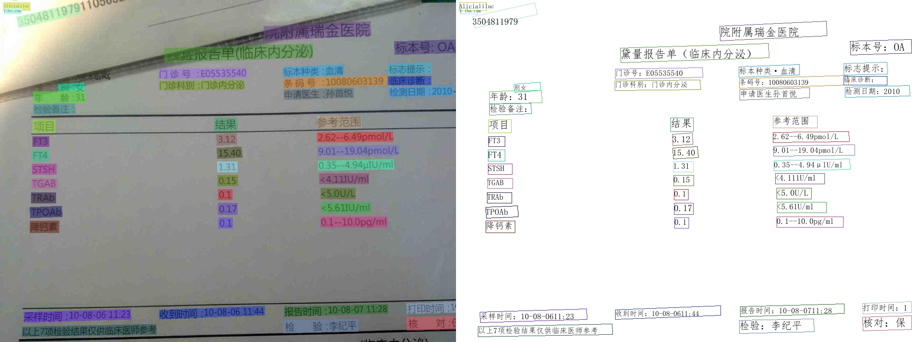

English | [简体中文](readme_ch.md)

# Jetson Deployment for PaddleOCR

This section introduces the deployment of PaddleOCR on Jetson NX, TX2, nano, AGX and other series of hardware.


## 1. Prepare Environment

You need to prepare a Jetson development hardware. If you need TensorRT, you need to prepare the TensorRT environment. It is recommended to use TensorRT version 7.1.3;

1. Install PaddlePaddle in Jetson

The PaddlePaddle download [link](https://www.paddlepaddle.org.cn/inference/user_guides/download_lib.html#python)
Please select the appropriate installation package for your Jetpack version, cuda version, and trt version. Here, we download paddlepaddle_gpu-2.3.0rc0-cp36-cp36m-linux_aarch64.whl.

Install PaddlePaddle：
```shell
pip3 install -U paddlepaddle_gpu-2.3.0rc0-cp36-cp36m-linux_aarch64.whl
```


2. Download PaddleOCR code and install dependencies

Clone the PaddleOCR code:
```
git clone https://github.com/PaddlePaddle/PaddleOCR
```

and install dependencies：
```
cd PaddleOCR
pip3 install -r requirements.txt
```

*Note: Jetson hardware CPU is poor, dependency installation is slow, please wait patiently*

## 2. Perform prediction

Obtain the PPOCR model from the [document](https://github.com/PaddlePaddle/PaddleOCR/blob/dygraph/doc/doc_en/ppocr_introduction_en.md#6-model-zoo) model library. The following takes the PP-OCRv3 model as an example to introduce the use of the PPOCR model on Jetson:

Download and unzip the PP-OCRv3 models.
```
wget https://paddleocr.bj.bcebos.com/PP-OCRv3/chinese/ch_PP-OCRv3_det_infer.tar
wget https://paddleocr.bj.bcebos.com/PP-OCRv3/chinese/ch_PP-OCRv3_rec_infer.tar
tar xf ch_PP-OCRv3_det_infer.tar
tar xf ch_PP-OCRv3_rec_infer.tar
```

The text detection inference:
```
cd PaddleOCR
python3 tools/infer/predict_det.py --det_model_dir=./inference/ch_PP-OCRv2_det_infer/  --image_dir=./doc/imgs/french_0.jpg  --use_gpu=True
```

After executing the command, the predicted information will be printed out in the terminal, and the visualization results will be saved in the `./inference_results/` directory.


The text recognition inference:
```
python3 tools/infer/predict_det.py --rec_model_dir=./inference/ch_PP-OCRv2_rec_infer/  --image_dir=./doc/imgs_words/en/word_2.png  --use_gpu=True --rec_image_shape="3,48,320"
```

After executing the command, the predicted information will be printed on the terminal, and the output is as follows:
```
[2022/04/28 15:41:45] root INFO: Predicts of ./doc/imgs_words/en/word_2.png:('yourself', 0.98084533)
```

The text  detection and text recognition inference:

```
python3 tools/infer/predict_system.py --det_model_dir=./inference/ch_PP-OCRv2_det_infer/ --rec_model_dir=./inference/ch_PP-OCRv2_rec_infer/ --image_dir=./doc/imgs/00057937.jpg --use_gpu=True --rec_image_shape="3,48,320"
```

After executing the command, the predicted information will be printed out in the terminal, and the visualization results will be saved in the `./inference_results/` directory.


To enable TRT prediction, you only need to set `--use_tensorrt=True` on the basis of the above command:
```
python3 tools/infer/predict_system.py --det_model_dir=./inference/ch_PP-OCRv2_det_infer/ --rec_model_dir=./inference/ch_PP-OCRv2_rec_infer/ --image_dir=./doc/imgs/  --rec_image_shape="3,48,320" --use_gpu=True --use_tensorrt=True
```

For more ppocr model predictions, please refer to[document](../../doc/doc_en/models_list_en.md)
